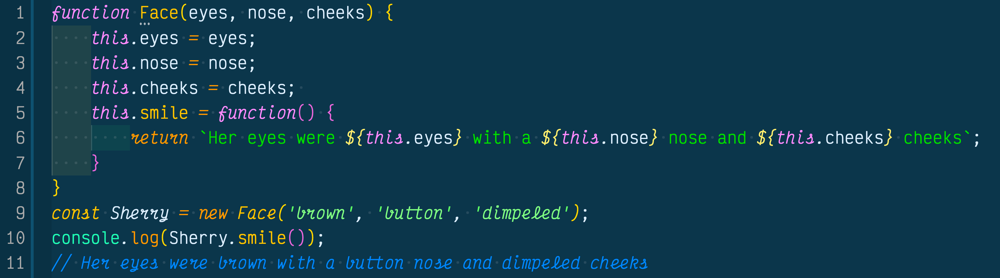

Arrow function expressions are a JavaScript ES6 feature that was released in 2016. Arrow functions can create functions without using the function keyword and doesn't have to use the return keyword in most cases.

## Traditional Function Expression
For traditional function expressions we bind it to a variable using `var`, then make it equal to an anonymous function and use the return keyword to trigger an expression.

## Arrow Function Expression
For [arrow function expressions](https://developer.mozilla.org/en-US/docs/Web/JavaScript/Reference/Functions/Arrow_functions) we can take out a lot of the verbose syntax used to create a simple function expression. In the example below we bound the capitalizeStringArrow function to a const variable and totally took out the function keyword. Then we made it equal to a single parameter and took out the paranthesis because we don't need them if a single parameter is declared. We used the fat arrow (=>) and took out the curly braces and pointed directly towards the expression used to capitalize the first letter of a string. In addition, we took out the return keyword because we have the function fat arrow pointing directly to the expression, so this tells the JavaScript engine we want to return this without writing out the return keyword.

## Arrow Function Caveats
You can esily see why arrow functions are so great, with the fact it takes less syntax to write out and it is easier to read than a standard function expressions. However, there are some caveats to using arrow functions.

### 1. Standard Constructor With Function Keyword

### 2. Arrow Functions Don't Work Well As Methods

This smile method in above example works because the arrow is pointing to the expression showing we want to return it.

This smile method doesn't work in the above example with curly braces and the return keyword because it is no longer apart of the constructor, instead this is not located in the constructor because it is outside of the method scope.

### 3. Arrow Functions Cannot Create Constructors

Arrow functions cannot create function constructors. Instead it throws a TypeError.

## Conclusion
Arrow funcitons are great because we can type less code to get the same results as writing a standard function expression while making it easier to read in a declarative fashion. However there are some caveats that create different results when using them in methods and we can't create constructor functions with them. Besides that I love them and can't wait to keep using them in my programs!