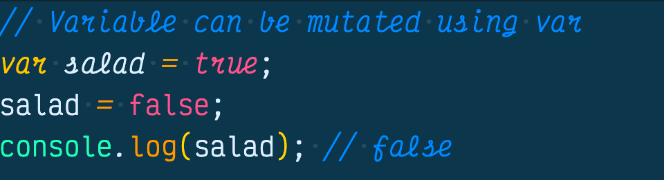
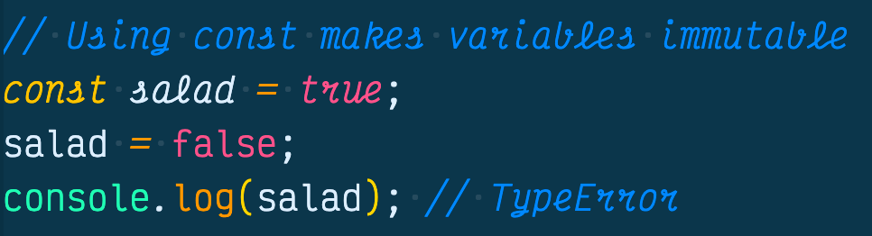
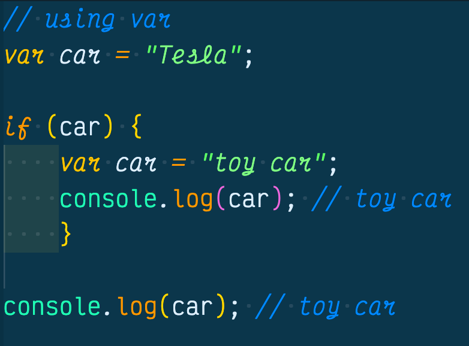
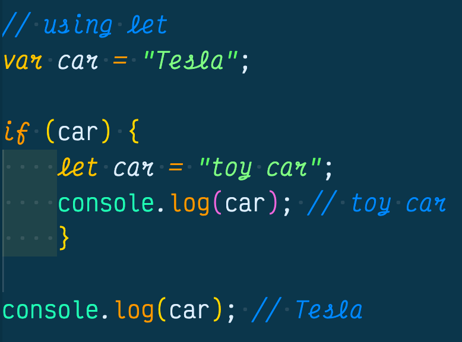

If you are like me and found that when ES6 came out, you were scratching your head when you saw there were two new variable options, const and let. Since JavaScript is the first languauge I learned, I didn't know there were any other variables bindings out there except for var. If you had the same experience or are currently having this experience right now, please read on and learn the difference between const and let variables.

## What Is A Const Variable?
A const variable stands for "constant" meaning it cant change. Const variables are part of the ES6 spec which was rolled out in 2016. The reason we have const variables now is so we have a way to make variables immutable (we can't change them). This comes in handy when we are working with global variables or if we don't want a variable to change. The following example shows how a global variable is changed using var:

In the next example we use a const variable instead of var, and the console throws a TypeError when we try to change it.

## What Is A Let Variable?
When I first saw a let variable I figured it replaced var and we never had to use it ever again. Now I realize that var and let are different, and var still has its place in JavaScript. With the creation of let, we can have more control over [lexical scoping](https://developer.mozilla.org/en-US/docs/Web/JavaScript/Closures), which is great when we want to create closures, but not so great because it can cause bugs in our code.

Before let, if a variable was created inside of a conditional if/else statement, it could permanently change a global variable with the same name.

Imagine you enetered a drag race against someone driving a Tesla. You agreed to make six laps and whoever finished first, has to give up their pink slips. You both raced and you beat the other driver and won their Tesla! Well when it was time to process your new pink slip, the DMV software was outdated and was still using var instead of let in their code. Somehow a toy car was sent to your house instead of your new Tesla. See how this happened:

See how var can be a huge issue by changing the car global binding from Tesla to toy car so easily, with only a few lines of code. 

This is where the let variable comes in handy.

## Conclusion
With the rollout of const and let variables, programmers have much more control over their program then only using var. If you ever forget what the difference is between let and var, just remember if you want a Tesla over a toy car, use let.