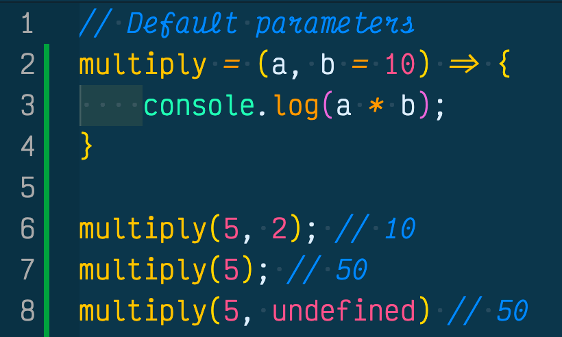
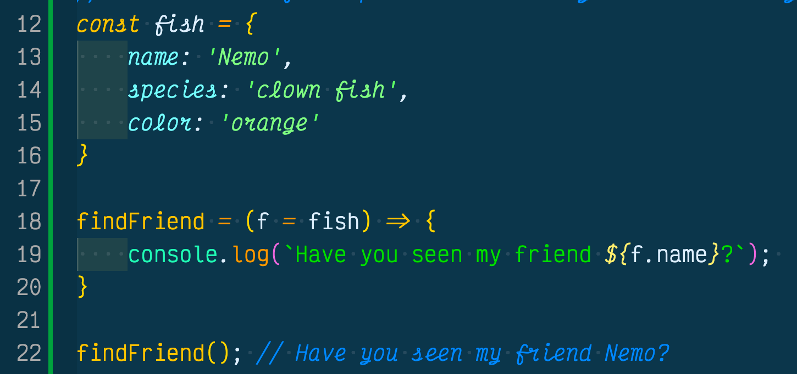

If you are like me and you haven't come from another programming language except for JavaScript, then you probably haven't heard of default parameters either. If you want to learn more about default parameters then please read on!

## What Are Function Default Parameters?
According to [MDN Web Docs](https://developer.mozilla.org/en-US/docs/Web/JavaScript/Reference/Functions/Default_parameters), default function parameters allow named parameters to be initalized with default values if no value or undefined is passed to a function. That is a mouthful, but pretty much default parameters ensures your function will run even if an argument isn't initialized or the argument is undefined.

In the above example we see that the default parameter for the multiply function is the second paramter. We named the parameter "b" and binded it to the number 10 using the equal sign (=). 

When we called the multiply function on line 7, we only initilized one argument of 5 but the function returned 50. This is because our default function was called into play and told the JavaScript engine that if there is no argument in the sceond element of the function invocation, to then use the default parameter of 10. Hence, our function still ran and returned 50 instead of returning NaN (Not A Number).

In addition, when we called the multiply function on line 8, we declared the second argument as "undefined" and the function still returned a valid answer instead of returning NaN. This shows that default parameters work if an argument is undefined. 

## Default Parameters Can Be Objects Too
Default parameters can be objects as well. If you create an object you can initialize your object inside of a default parameter in your function. See below we created the "fish" object and listed out its properties. Then we created the "findFriend" function and bound the parameter "f" to the "fish" object, this has now given us access to the properties located in the object. 

We invoked the "findFriend" function and used dot notation inside of a template string to ask "Have you seen my friend Nemo?". We could access the rest of the properties in the object by just using dot notation to call the parameter followed by the property key name.

## Conclusion
In conclusion you can use default parameters to ensure your function will pass even if an argument isn't initialized or if an argument is undefined. This is a powerful tool to add to your JavaScript toolbelt.