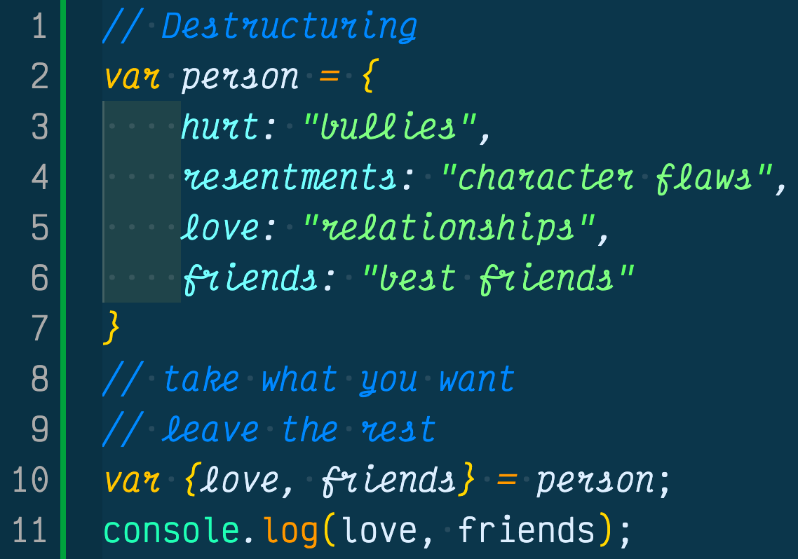
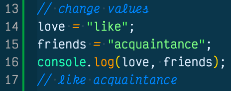

Destructuring with JavaScript is a new assignment that rolled out with the ES6 spec in 2016. Destructuring assignment allows you to pull out the values you want of an object and leave the rest, without mutating the object. 

I first ran into destructuring when I blindly started learning React and realized I was saving a ton of space by only pulling certain values from an object. I had no idea destructuring was actually part of ES6, so I decided to take a deeper dive into destructuring. If you want to learn more about destructuring in JavaScript, please read on!

## Destructuring An Object
When I think of destructuring an object, I think of taking an object and pulling out only what I need and leaving the rest. This Buddhist philosphy of assigning objects really helped me to understand the importance of destructuring both in programming and in my daily life. 

In the above example we created a `person` object and listed out its properties, nothing new. Then on line 10 we see var followed by curly braces with two of the person property key's of `{ love, friends }` followed by a binding equal sign to the object person. This is how we destructure an object.

We took the two properties we wanted from the person, `love` and `friends`, and left the rest. We did this by declaring a variable followed by placing the properties we wanted to take from the object inside of curly braces. Last we made it equal to the object we want to take the properties from.

This makes sense when we run console log and return the property values we destructured, but what is actaully going on under the hood that allows us to do this so easily? It has something to do with local scoped variables.

### Destructuring Creates Local Scope
From the previous example, we destructured two properties, **love** and **friends** from the **person** object and we were able to use their values outside of the object. In addition, we didn't mutate the properties which means we can still use the person object from its original form. But how were we able to do this without dot notation or somehow digging into the object?

The answer is destructuring allows us to locally scope fields...ok, so what does this mean? 

Well when we wrote var before the curly braces on line 10, what we were telling the JavaScript engine was, we wanted to create new variables located in the curly braces and we want the values to be pulled from the object person. 

In turn, the JavaScript engine said ok, and created two new locally scoped variables.

These variables act just like regular old variables, which is great and pwerful!

What if we needed to change the values of the variables though? Please read on to learn how.

### Change The Value Of Destructured Variables
So now that we have locally created variables from destructuring property values from the person object, what if we needed to change their values?

Luckily, they act like regular variables and we can change their values just like we would with a regular variable.

It's easy as that, nothing to it.

## Conclusion

This is just scratching the surface of how to destructure objects and pass around their values. Just keep in mind that when you destructure an object, you aren't mutating it and you are creating locally scoped variables that can be changed in the future if you need to.

If you want to learn more about destructuring and go more in depth, here is the link from [MDN Web Docs about destructuring assignment](https://developer.mozilla.org/en-US/docs/Web/JavaScript/Reference/Operators/Destructuring_assignment). 