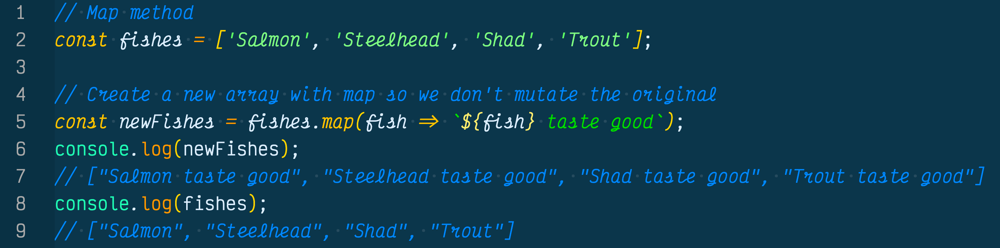
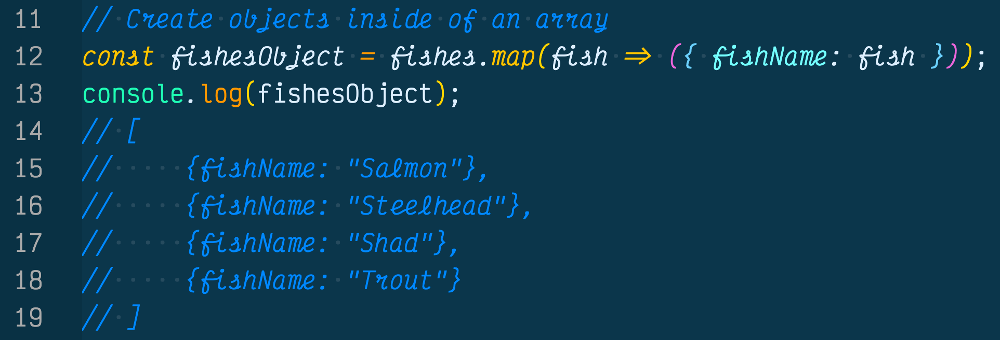
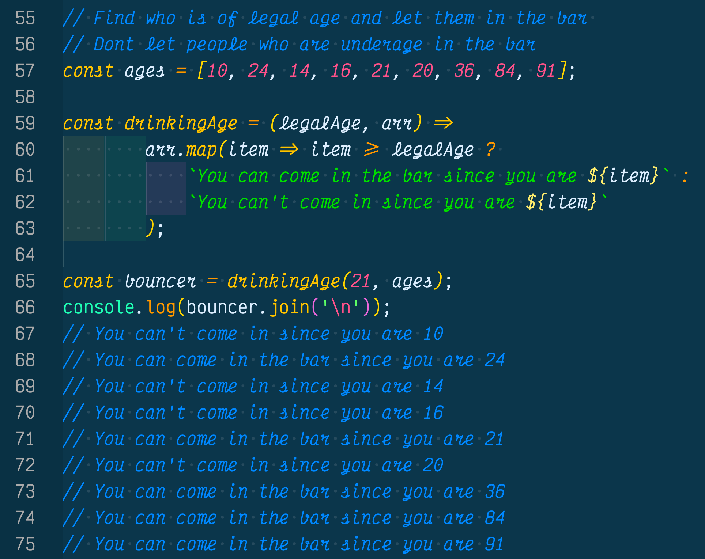

If you are like me and have had slight brushes with the map method with JavaScript ES6, but were unsure how they worked or even why you everyone is so excited about them, then you are in the right place.

I will go over why the map method is useful in functional programming and how you can use them in your daily code without needing to run a for loop again. Please sit back, and let the mapping begin!

## Why Should I Care About The Map Method?
The map method in JavaScript is a higher-order function which came out with the ES6 spec in 2016 and is now a baked in option we can use in JavaScript arrays which we can access at anytime.

The map method has changed the JavaScript world by allowing us to transform data in an array without actually mutating the data. Think about that, we can change transform data, without mutating it, how is this possible. 

The map method will actually make a copy of the original array, create a new empty array, transform the data, and gently place the transformed copy into that new array.

I didn't think this was such a big deal until I started researching functional programming, pure functions, and learning React. One thing all of those have in common is we cannot mutate data, meaning we cannot change original variables, objects or arrays. 

Well, the map method ensures we will enver mutate data because it makes a copy of it and we can keep making copies of the original data.

Now that we know why we should care about the map method, let's have some real fun and see the map method in action.

In the above example we created the `fishes` array with four string values `Salmon, Steelhead, Shad, Trout`. We had the four values of fishes but we wanted to iterate through the array and add the string `tastes good` at the end of each fish name, but we don't want to mutate the values inside of the fishes array. 

Normally (pre-ES6) we would have to create an empty array, iterate through the array with a for loop, add the string 'tastes good' to each element, then return the new array.

Well now that arrays have the map method we can easily "map" through the array and add on 'tastes good' to each element with one line of code and an arrow function without having to create a new array, since the map method automatically creates the map method for us. 

As you can see we used a pure function to declare a function expression `newFishes` and used the map method to create a new array with the string 'tastes good' at the end of each element in the array. You will also notice it did not mutate the fishes array since all of its data has remained intact. 

Not only has this saved us time, space, headache, but the map method is actually very readable. This is no accident.

The map method is declarative, meaning it declares what the function should do, instead of it being imperative or how the function should do it (think `for` loops). This means it is readable for humans and is asynchronous. 

The map method can also handle objects, as you will see next we can create objects inside of an array using the map method.

## Create Objects Inside An Array With Map()
Not only can we transform data inside an array using strings while making it immutable, we can also do this with objects.

In the next example we will once again use the `fishes` array and this time create objects inside of a new array with the data from the fishes array using the built in array map method. 

As you can see in the example above we created three objects inside of the array `fishObject`. We did this by using the map method to access the `fishes` array. 

Then we told the JavaScript engine we wanted to look at each element in the array by declaring one parameter which was `fish` and used the arraow function to point to the each element in the array. 

In turn the map method created a new array and made each element inside of the fishes array an object with a key `fishName` and made the value equal to each element value in the fishes array.

Once again using the map array we created a new array with a new collection of four objects inside of it, without actually mutating the original data...with one line of code. Magic!!

The last thing we will go over is a questions I have been asked before in JavaScript interviews and I totally bombed because they wanted me to use the map method, which I didn't know at the time. Well now I know how to use it, and you will probably get asked the same question in a coding interview so please read on!

## Determine Who Can Come Into Your Bar
In this final example of how we can use the map method in the real world, we are going to solve a problem that many interviewers at companies will ask you to answer during a coding interview.

Using the `ages` array determine who is allowed to come into your bar if they are 21 years or older, utilizing the map method. In addition, tell the people who are underage they are not allowed to come into the bar because they are underage. 

As you can see we were given the `ages` array with numerous numerical ages ranging from 10 years old to 91 years old.

In order to solve this problem we first created a pure function expression of `drinkingAge`  and created two parameters `legalAge` and `arr` (array). Next we used the fat arrow function and pointed to our map method. 

We told the JavaScript engine that we wanted to use this function to map through an array and iterate through each item in the array and compare each item to the designated `legalAge` parameter. 

Next we created a conditional ternary operator to say if the person's age is greater than or equal to the legal age to tell the person 'You can come in the bar since you are "age"'. 

If you are not greater than or equal to the legal age then tell the person 'You can't come in since you are "age"'

Last, we created a new variable `bouncer` to call the newly created drinkingAge function and set it's arguments to `21` and the `ages` array, thus letting the bars potential patrons if they can enter the bar or not.

Did I mention we did all of this inside of a new array and we did not mutate the original ages array!

## Conclusion
The map method is a higher-order function which was released with the ES6 spec in 2016 and is now a built in method we can call at anytime on an array which can be used to transform data without mutating the original array. 

The map method can be used to create new objects inside of an array, iterate and add onto elements inside of an array, or even not allow people inside of bars by using a conditional statement to determine if you are of age or not. 

Hope this was helpful in your quest to understand the map method. There is a lot more you can do with the map method, that I am still learing as well, if you want to learn more take a look at the [MDN Web Docs on map](https://developer.mozilla.org/en-US/docs/Web/JavaScript/Reference/Global_Objects/Map). 

The map method is the backbone of functional programming and once you understand this, along with the other higher-order functions such as [filter()](https://developer.mozilla.org/en-US/docs/Web/JavaScript/Reference/Global_Objects/Array/filter) and [reduce()](https://developer.mozilla.org/en-US/docs/Web/JavaScript/Reference/Global_Objects/Array/reduce), you can use modern JavaScript frameworks and libraries such as React. 

