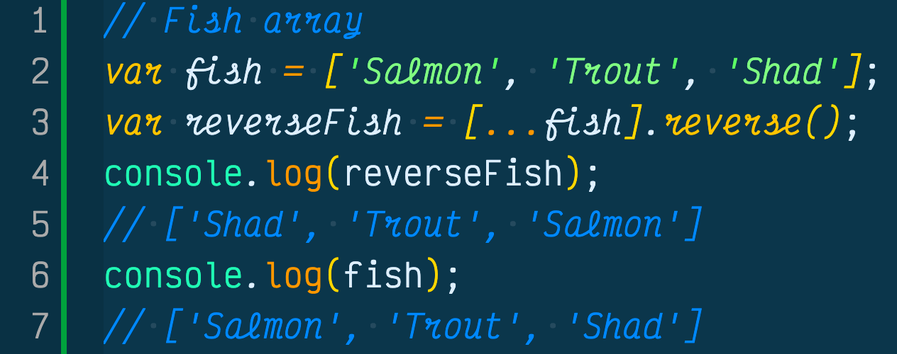
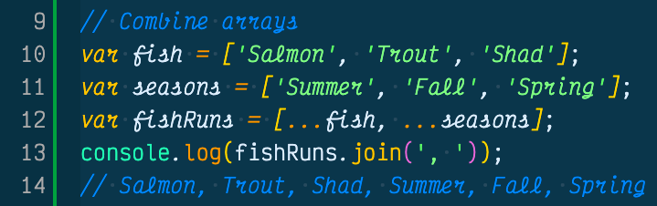

Yes, the spread operator is the three dots (...) you see in that JavaScript code. If you haven't seen this before, it was released with the ES6 2016 JavaScript spec. The spread operator looks very simple, but in fact it has some very powerful benefits, including acting like a copy machine. If this has intrigued you and you want to learn more (shameless I know...) please read on!

## Spread Operator
If you wondered what the three dots (...) in a piece of JavaScript code is, you are viewing the spread operator. The spread operator has many uses, however the most important one to understand is spread operators give us a way to copy a value so we don't mutate the value. This concept is important for functional programming and for React, since we can make a copy of an array or an object and perform whatever surgery we need to it, while the original value doesn't change at all. 

I think of a spread operator the same way I think of branching in GitHub for version control. The original value is the master branch, then when I want to make a change, I create a branch first, use the spread operator, then I can work on the copied branch without actually touching the original master version. 

Next we will show you how the spread operator can make a copy of an array then reverse it while not mutating the original array.

## Make A Copy Of An Array And Reverse It
In order to understand how the spread operator works, we will show you how to make a copy of an array, then reverse the array, then see if the original array was mutated from the reverse method. (See below)

As you see in the above example, first we created the `fish` array with three elements in it: Salmon, Trout, Shad. 

On line three we created a new array name called `reverseFish` and made it equal to the fish array. However, we used square brackets with three dots in front of the fish array name. The spread operator copied the fish array. Following the copy of the fish array we called the reverse method function to reverse the copy of the fish array.

We then console logged the reverseFish array, and as you see it in fact reversed the fish array with Shad now at the 0 index.

Last we console logged the original fish array, and see the original element values didn't change.

This shows the power of the spread operator and how easily we can make a copy of values with only three dots.

Next we are going to combine two arrays, something would normally take a few lines of code and some for loops. Now we can combine arrays with onle line and three fun dots (...), please read on.

## Combine Two Arrays
If you need to combine two arrays, or multiple arrays, you can now do so with only one line of code by utilizing the spread operator (...). We will quickly show you how to do this by first creating two arrays then combining them into one array.

In the example above we created two arrays, `fish` and `seasons`. In the fish array we listed three fish and in the seasons array we listed the three seasons the fish run up river corresponding to their element index location.

This is great, but what we really want to do is combine both arrays into one array listing the fish and the seasons the fish run up river.

To do this we created a new array to combine both the fish and seasons array and we named it `fishRuns`. 

In fishRuns we created a square bracket array and listed both the fish and seasons array, with the spread operator (...) in front of each array name. 

Since we know from previous examples the spread operator actually copies the original value, we know that both the fish and seasons array's are actually just copies of the original, so we don't have to worry about the original value being mutated.

Since we can make a copy we are telling the JavaScript engine to take a copy of these arrays and place them in a new array called fishRuns.

Last we console logged the fishRuns array and see both array values are now located in the fishRuns array.

Success, we did it! Simple right?

## Conclusion
There are many other things you can do with the spread operator, if you want to learn more here is the [spread operator MDN Docs](https://developer.mozilla.org/en-US/docs/Web/JavaScript/Reference/Operators/Spread_syntax) link to review a more in-depth explanation. However, if there is one take away from the spread operator is, we are making a copy of the original value so we can mutate the copy and leave the original as is.