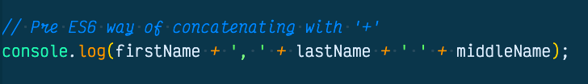
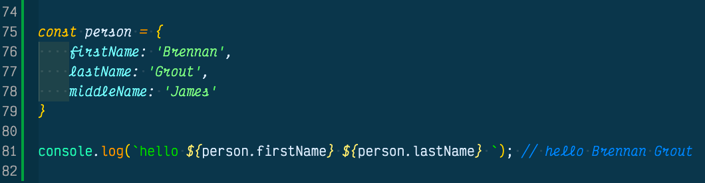
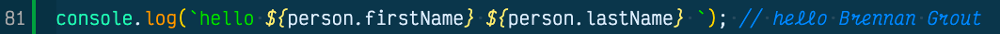
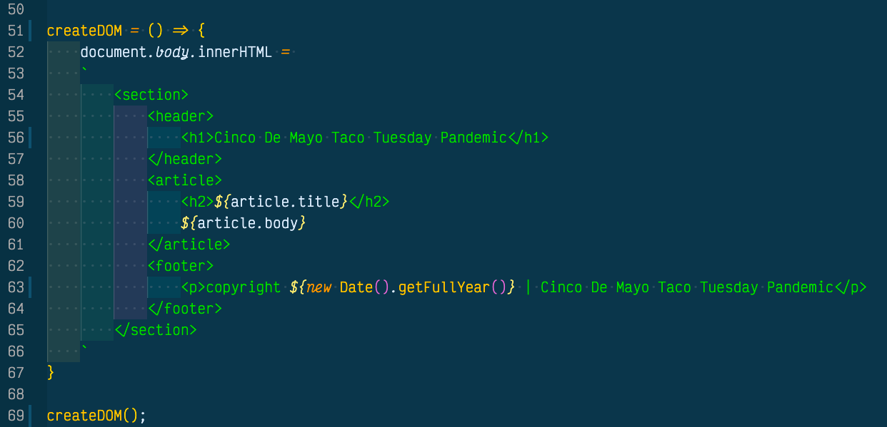

If you have seen template string backticks(`), dollar signs($), and curly brakets({}) in JavaScript ES6 code, but have no idea why they are there, you are in luck because that is what this blog post is about. Keep reading to learn more!

## Old Way Of Concatenating Strings (+)
One of the first things I learned about JavaScript was using the plus sign (+) to concatenate strings together. We had to concatenate variables and strings with proper spacing to control whitespace. 

Now with ES6 rolled out we can use [template string concatenation](https://developer.mozilla.org/en-US/docs/Web/JavaScript/Reference/Template_literals) to connect strings to variables by using backticks (`), dollar signs ($), and curly braces ({}). 

## Template String Backticks (`)
The backticks tells the JavaScript engine that we are going to use template strings. The great thing about template strings is it honors whitespace.

This makes creating strings so much simpler and much easier to read. Now we can quickly concatenate variables and strings all together and not worry about spacing and if we added a plus sign in the right spot.

## Dollar Signs ($) & Curly Braces ({})
We add a dollar sign in front of a curly brace when we want to call a variable. This tells the JavaScript engine we are going to be adding a variable if it is inside backticks. This also makes it easier on the eyes to tell the programmer we are using variables in a string.

Template strings opens the door to declaritive programming and gives both the viewer and the programmer a better understanding of what the code is doing with one glance.

## Bonus - Create A DOM Tree
Before I started learning about template strings, I created a website strictly with low level JavaScript, which gave me a better understanding of how JavaScript frameworks create a DOM. Well with the advent of Template Strings, I could have created the same DOM with a lot less code and made it way more declaritive. 

## Conclusion
Template strings are very new and I personally love them. They have made me excited about programming in JavaScript and they are easy to use. Template strings are very powerful and will make your life much easier if you want to concatenate strings with variables, create an email template, or create a DOM without touching HTML. Hope this was helpful and let me know what you think on [twitter](https://twitter.com/realSacWebDev). Thank you!