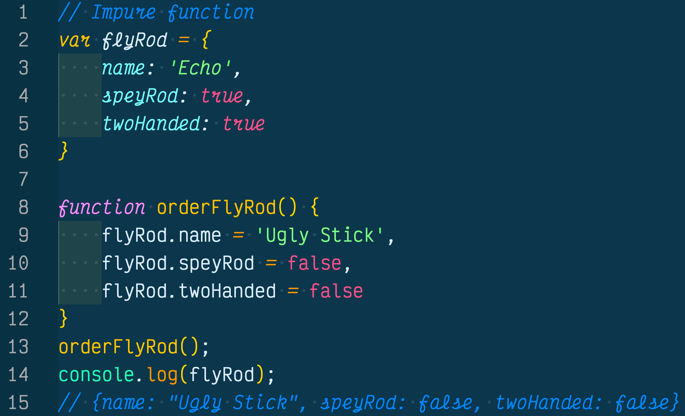
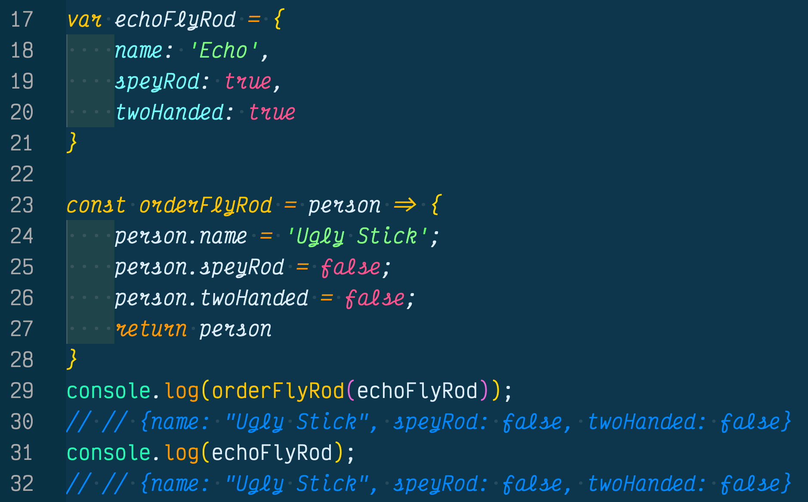
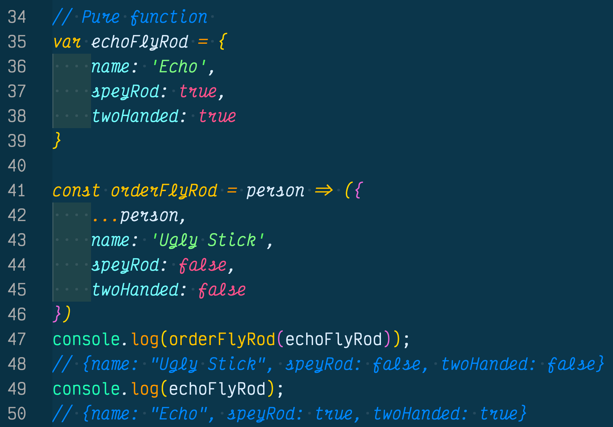

Pure functions in JavaScript should have the following three hard rules in order for them to be considered a pure function.

1. The function should take at least one argument

2. The function should return a value or another function

3. The function should not mutate any of its arguments

In addition to these three key rules, pure functions return a value that is computed based on its arguments, does not cause side effects, does not set global variables (great for functional programming), does not change state, and treats arguments as immutable.

## 1. Pure Functions Should Take In At Least One Argument
Pure functions should take in at least one argument is the simplest rule to follow and the first step in acknowledging a pure function in JavaScript.

Before we see what a pure function is, we should check out what a pure function is not (impure function).

In the (above example) we have written out an impure function called `orderFlyRod` that mutated the data of the `flyRod` object and caused side effects. 

In addition, the impure function did not take in an argument, which means it doesn't pass the first rule of pure functions, have at least one argument.

The next example we will create another impure function, however, this time it will take in at least one argument and will return a value, which is the second rule of a pure function

## 2. The Function Should Return A Value Or Another Function

In the (above example) we have created another impure function, however this time we took in at least one argument and returned a value, almost a pure function but not quite there yet. 

The function returns an object, however it is impure because it still mutates the original object data and causes side effects.

## 3. The Function Should Not Mutate Any Of Its Arguments

Now, let's create a pure function that takes in one argument and does not mutate the object's data (see below).

In this last example we have finally created a pure function. As you can see we took in at least one argument and we did not cause side effects by mutating the orginal object data.

 

We avoided creating side effects to the original object data by using the spread operator `...person` which made a copy of the argument, then changing the data of the argument data whitout touching the original `echoFlyRod` data.

At the same time we returned an object by enclosing the new object properties inside of parenthesis, which tells the JavaScript engine twe want to return this without actually writing the return keyword.

## Conclusion
Pure functions require the following three rules in order to qualify it as a pure function.

1. The function should take at least one argument

2. The function should return a value or another function

3. The function should not mutate any of its arguments

Pure functions live in their own ecosystem and do not cause side effects, which comes in handy when we want utilize functional programming and if we want to perform testing on our applications.