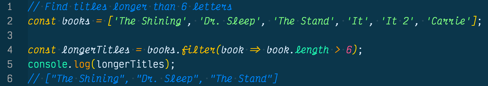
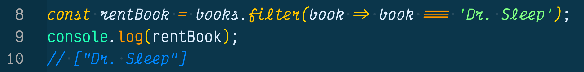
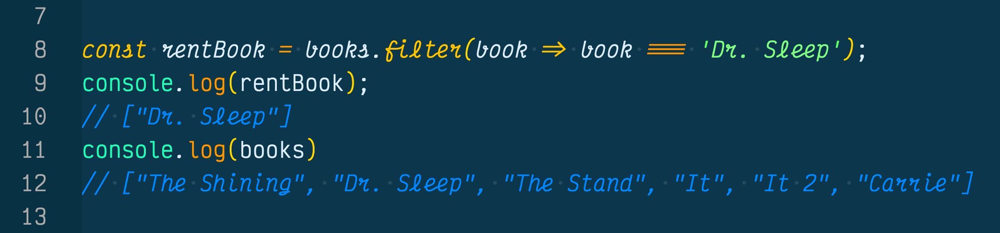
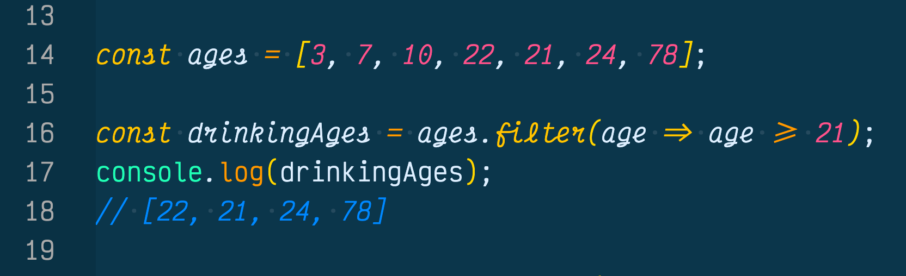
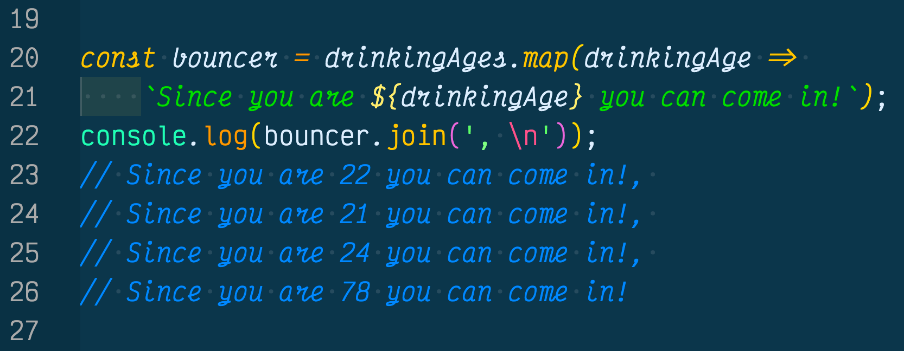

Are currently searching the web for answers on how to use the filter() method in JavaScript ES6 but nothing on the web makes sense? Welcome to an easy to digetst blog article about using the filter() method.

In this blog we will talk about what the filter method does, why it is beneficial, and how you can use it in your next job interview.

## What Does The Filter() Method Do?
The filter() method is a high order function that creates a new array following a set of instructions intended to filter out elements that pass the function test. 

Here is a simple example of the filter() method using a books array:

As you can see in the example above, we use the filter method to iterate through the books array and only return the books with a title lenght longer than 6 letters.

We can also use the filter method to pull out and rent a book from the library.

As you can see the filter method lets us filter out a book we have in mind, in this case it was "Dr. Sleep".

## Why Is The Filter() Method Beneficial?
The great thing about the filter method is it creates a new array for us and places the filtered elements into that array. 

This is great for function programming because it means we don't mutate the original data of the array. 

So we can do a lot of different things to the books array using the filter method, and the original data will never change. 

Like in the example (below) the original books array hasn't been mutated by the filter method. Instead the filter medthod created a new array called `rentBook` and filtered out "Dr. Sleep" for us, then placed it in the rentBook array.

This is the building blocks of functional programming and using JavaScript libraries such as React.

## Using Filter() Method To Filter Drinking Age
Lastly, we will show you how we can use the filter method in a common job interview question. 

Filter out the drinking age of the ages array of people who are 21 and older, and let them know they can come into the bar.

In the above example we use the filter array to iterate through the `ages` array and find people who are 21 and older.

Next we can use the map method to tell those people they can come into the bar since they are of legal drinking age. 

In the (above) example we used the map method, another high order function, to iterate through the filtered `drinkingAges` array we created earlier, and tell each patron they can come into the bar since they are 21 or older.

If you want to know more about the map method, read our other blog about [How To Use Map Method In JavaScript](https://sacramentowebdeveloper.com/how-to-use-map-method-in-javascript/)

## Conclusion
The filter() method is a high order function that you can use to filter out the elements you want from an array or write a simple set of rules to return elements that pass the test.

If you would like to know more about how to use the filter() method, check out what [MDN web docs has to say about the filter method](https://developer.mozilla.org/en-US/docs/Web/JavaScript/Reference/Global_Objects/Array/filter).

Hope this was helpful and good luck on your journey!